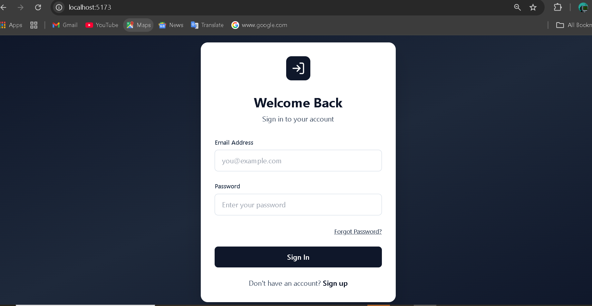
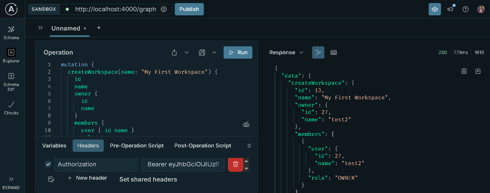
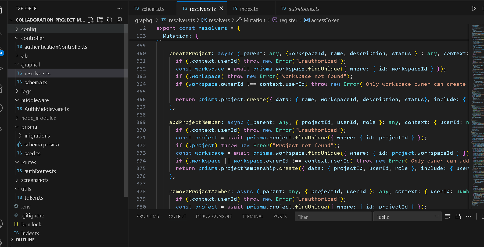

# Collaboration Project Management System

## Description
A full-stack project management system built with **React, Flutter, Node.js, PostgreSQL, and GraphQL**, allowing users to manage workspaces, projects, tasks, and notifications in real-time with subscriptions.

---

## Features
- User authentication (register/login) with JWT
- Workspace management: create, add/remove members, assign roles
- Project management: create projects, add/remove members
- Task management: create, update status, assign/unassign tasks
- Notifications system for task updates
- Real-time updates via GraphQL subscriptions
- REST endpoints for authentication
- Full integration of frontend and backend

---

## Tech Stack
- **Frontend:** React, Flutter
- **Backend:** Node.js, Apollo Server (GraphQL), Express
- **Database:** PostgreSQL with Prisma ORM
- **Authentication:** JWT
- **Real-time:** GraphQL Subscriptions (WebSockets)
- **Testing:** Postman / GraphQL Playground (manual testing)

---

## Setup / Installation

1. Clone the repository:
```bash
git clone <repo-url>
cd collaboration_project_management
```

2. Install dependencies:
```bash
bun install
```

3. Setup environment variables (`.env`):
```
ACCESS_TOKEN_SECRET=<your_jwt_secret>
DATABASE_URL=<your_postgres_url>
PORT=4000
```

4. Run database migrations:
```bash
npx prisma migrate dev --name init
```

5. Start the server:
```bash
bun run start
```

6. Open **GraphQL Playground** at `http://localhost:4000/graphql` to test queries, mutations, and subscriptions.

---

## Screenshots

**1. User Login / Register**  


**2. Workspace Dashboard**  


**3. Project View**  


**4. Task Management**  


**5. Notifications**  


---

## How to Test
- Use **GraphQL Playground** to test all queries, mutations, and subscriptions
- Use **Postman** or **Insomnia** to test REST authentication endpoints
- Real-time updates for tasks and notifications can be verified by opening multiple clients

---

## Notes / Known Issues
- Make sure WebSocket port is open for subscriptions
- JWT expiration is 15 minutes; refresh manually during testing

---

## Author
**Wubishet Wudu** – Full Stack Developer  
Portfolio: <your-portfolio-link>  
GitHub: <your-github-link>
